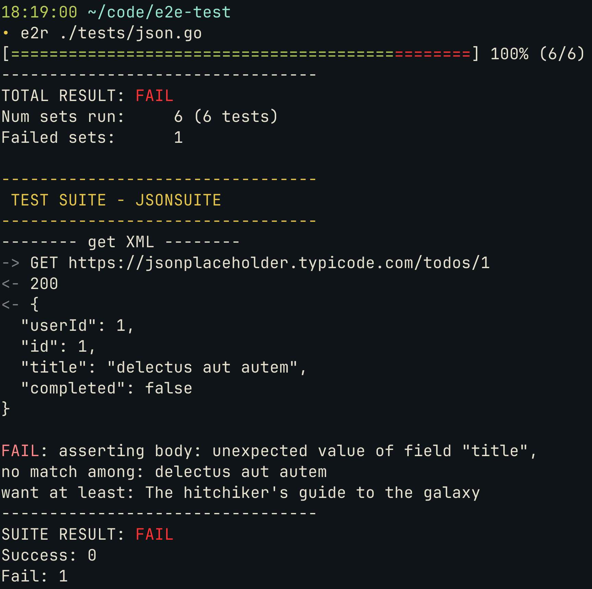

# Go-e2e
This is just a small library I wrote over a couple of days this weekend to test my own HTTP APIs. It's only written for my own personal gain. It's not tested and it only supports my own narrow set of requrements. Now that's out of the way.

Go-e2e was written to be a quick and concurrent facilitator of HTTP API tests. From my own manual testing it seems to scale pretty constantly and run whatever amount of tests in about a second, though it's only been tested on at most about 130 tests in one go.

Go-e2e is a library, meaning it has no main function. To use it you create an empty go-module with a main fuction, create a `Runner` and call `Run` on a list of test sets you've declared yourself. 

```go
import (
	"github.com/gomsim/go-e2e"
)

func main() {
	e2e.Runner{}.Run(
		AuthSuite,
		EmailSuite,
		NotificationsSuite,
		UsersSuite,

		LoginSequence,
		RegisterUserSequence,
		CreateEventSequence,
	)
}
```

Then you run your app. You will be presented with a progress bar which when filled will give way to a result summary as well as a prompt giving you the option to see only the logs of failed tests cases or to see the logs of all performed tests (lots of text).



But what is a "test"?

## Tests
So the whole point of the library is its ability to run test cases. Each `Test` consists of a `Setup` and an `Expect`. The setup describes the details of a single HTTP call to be made. The expect describes expectations of the HTTP response. Tests which receive HTTP responses that don't meet the expectations count as failures.

```go
e2e.Test{
    Setup: e2e.Setup{
        Method: "GET",
        URL:    "mydomain.com/ping",
    },
    Expect: e2e.Expect{
        Status: 200,
    },
}
```

## Suites
To make testing somewhat feasible and organized tests can be gathered in sets of type `Suite`. A suite has a name and is a set of independent named tests with no order.

```go
e2e.Suite{
	Name: "myService",
	Tests: e2e.Tests{
		"ping": {
			Setup: e2e.Setup{
				Method: "GET",
				URL:    "mydomain.com/ping",
			},
			Expect: e2e.Expect{
				Status: 200,
			},
		},
		"create": {
			Setup: e2e.Setup{
				Method: "POST",
				URL:    "mydomain.com/creatething",
			},
			Expect: e2e.Expect{
				Status: 201,
			},
		},
		"auth": {
			Setup: e2e.Setup{
				Method: "POST",
				URL:    "mydomain.com/login",
				Body:   `{"user": "username", "password": "password"}`,
			},
			Expect: e2e.Expect{
				Status: 200,
				Header: e2e.Headers{
					e2e.Header{"Set-Cookie", "session_id=abc123xyz"},
				},
			},
		},
	},
}
```

## Sequences
Some tests require some setup. Or perhaps testing of one HTTP request requires information contained in the response to a different HTTP request. This is where type `Sequences` comes in. Sequences resemble suites in that they have a name and a collection of tests, but have some other nice features. A sequence is, well sequential, meaning tests are run in the order they are declared. Tests within sequences are also of type `Step`. This is because tests, or steps, in a sequence are not indipendent but _interdependent_. While a suite test can only contain a setup and expectations a sequence step can also take input and give output. There are two ways to do this. A manual `InputFunc` or a `Captor`. They share a likeness under the hood, but have different use cases. An input func is declared within a step if the step requires some external information in order to be performed, such as a pin code or some other information retrieved from a third source. When the tests are run the opportunity will be presented for the user to input the data as needed. Captors on the other hand are declared within a step to let it capture information contained within its HTTP response, such as an oid or URL, and let subsequent steps reference it to perform their own HTTP calls.

```go
e2e.Sequence{
	Name: "finger print - order flow",
	Steps: []e2e.Step{
		{
			Setup: e2e.Setup{
				Method:  "POST",
				URL:     "mydomain.com/fingerprint/create",
				Content: "application/json",
				Body:    `{"user": "MyUser", "phone": "010111000",}`,
			},
			Expect: e2e.Expect{
				Status: 201,
				Fields: e2e.Fields{
					"message": "OK"
				},
			},
		},
		{
			Inputs: []e2e.InputFunc{
				e2e.Input("finger print", "fingerprint"), // Propmpts the user for "finger print" and stores the input in a memory location called "fingerprint"
			},
			Setup: e2e.Setup{
				Method:  "POST",
				URL:     "mydomain.com/fingerprint/apply",
				Content: "application/json",
				Body:    `{"print": "$fingerprint"}`, // References the stored "fingerprint"
			},
			Expect: e2e.Expect{
				Status: 200,
				Fields: e2e.Fields{
					"token": "",
				},
			},
			Capture: e2e.Captors{"token"}, // Captures whatever was the value of the "token" field in the response body
		},
		{
			Setup: e2e.Setup{
				Method:  "POST",
				URL:     "mydomain.com/auth/token",
				Headers: []e2e.Header{{Key: "Authorization", Val: "Bearer $token"}}, // References the stored "token"
			},
			Expect: e2e.Expect{
				Status: 200,
				Fields: e2e.Fields{
					"url": "",
				},
			},
			Capture: e2e.Captors{"url"}, // Captures whatever was the value of the "url" field in the response body
		},
		{
			Setup: e2e.Setup{
				Method: "POST",
				URL:    "$url", // References the stored "url"
			},
			Expect: e2e.Expect{
				Status: 200,
			},
		},
	},
}
```