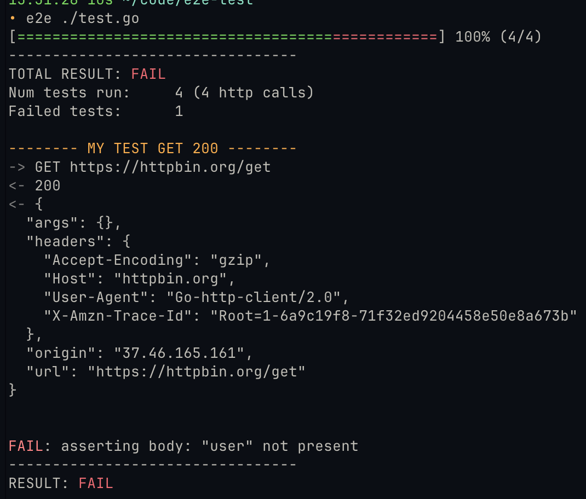

[](LICENSE)
[](https://github.com/gombrii/go-e2e/tags)


# Go-e2e
Go-e2e is created to be a quick and concurrent facilitator of HTTP API tests.

There are two parts to this project: the `e2e` library and the `e2e` tool. The library is used to define test cases that can then be run using the tool.

## Getting started
Tests are declared in Go modules. A minimal setup is a catalogue containing a `go.mod` file and one `.go` file. That setup will be used for this setup guide.

Run these commands.

```shell
mkdir mytests
cd mytests
go mod init
touch test.go
```

You should then have this project catalogue.

```
mytests/
├── go.mod
└── test.go
```

Before writing any tests get the `github.com/gombrii/go-e2e` module.

```shell
# Inside catalogue mytests
go get github.com/gombrii/go-e2e@latest
```

To eventually run tests you either have to install the `e2e` tool or run it with `go run` using its install URL `github.com/gombrii/go-e2e/cmd/e2e`.

```shell
go install github.com/gombrii/go-e2e/cmd/e2e@latest
```

With this basic structure you can define tests that you run with the `e2e` tool. Try pasting the following test into your `test.go` and run it with `e2e test.go`. Read more about running tests under [Usage](#usage)

```go
var MyTest = e2e.Sequence{
	Name: "My test GET 200",
	Steps: e2e.Steps{
		{
			Request: e2e.Request{
				Method: "GET",
				URL:    "https://httpbin.org/get",
			},
			Expect: e2e.Expect{
				Status: 200,
			},
		},
	},
}
```

### More advanced example
The `setup.go` file in the example below is not required but is a good place to declare project level setup instructions as described in [Setup and teardown](#setup-and-teardown-optional) and [Addressbook](#addressbook-optional). For reasons that will be described later in this guide, not least of all simply organisational, you might want to define multiple files in multiple packages. How you choose to name your packages is up to you.

Eg.
```
mytests/
├── go.mod
├── setup.go
├── smoketests/
│   ├── test1.go
│   ├── test2.go
│   └── test3.go
└── manualtests/
    ├── test1.go
    ├── test2.go
    └── test3.go
```

## e2e tool
You can use the `e2e` CLI tool to run tests you have defined in your project.

A test run can look something like this:



### Usage

```
e2e [-v] <pattern> [env]
```

- `-v` is a boolean flag making the test output more verbose. Specifically it prints all response headers. Otherwise only the headers the test expects are printed.
- `pattern` describes the location of the tests you want to run. It uses the same format as `go test`. To run all tests in the project pass `./...`. You can also run all tests in a package or all tests in a file by providing their respective paths, eg. `./smoketests` or `./smoketests/test1.go` 
- `env` is an optional string value that if passed can be used for runtime lookups in the [`Addressbook`](#addressbook-optional) provided by the `e2e` library. This enables quick switching between testing base URLs specific to different environments.

Upon being run the `e2e` tool will look for any exported variables of type `Sequence` in the location targeted by the [`pattern`](#usage) provided and run them.

### Setup and teardown (optional)
There are two hooks that, if defined in the module root, will be run before and after each `e2e` tool run. These hooks can be used to perform any setup and/or teardown needed.

```go
func BeforeRun() any {
	// Any setup here
}

func AfterRun(any) {
	// Any teardown here 
}
```

For `e2e` to run them make sure to match their respective signatures exactly. Take note that they are exported. Whatever is returned by `BeforeRun` is what will be passed to `AfterRun` and can be accessed using a type assertion. If `BeforeRun` is not declared but `AfterRun` is, then `nil` will be passed.

### AddressBook (optional)
The `AddressBook` is a feature provided by the `addr` package that enables runtime address lookup using a predefined addressbook in combination with the [`env`](#usage) parameter. This is to be able to make tests environment agnostic. Instead of a hardcoded URL, a test will be targeted toward a named address defined in the `AddressBook`. The `env` passed will then decide which variant of that address will be used.

`AddressBook` is a nested `map` which you can register with a call to `addr.Set` in the `init` hook in the project root.

```go
import "github.com/gombrii/go-e2e/addr"

func init() {
	addr.Set(addr.AddressBook{
		"local": {
			"auth":  "http://localhost:8080/api/v1/auth",
			"users": "http://localhost:8081/api/v1/users",
		},
		"dev": {
			"auth":  "https://auth.dev.example.com/api/v1/auth",
			"users": "https://users.dev.example.com/api/v1/users",
		},
		"prod": {
			"auth":  "https://auth.example.com/api/v1/auth",
			"users": "https://users.example.com/api/v1/users",
		},
	})
}
```

Having registered an `AddressBook` makes it possible to perform lookups in tests like so `addr.Lookup("users")`. Paths can easily be appended using the plus operator.

```go
addr.Lookup("users") + "/user_2430"

// Alternatively addr.EnvLookup can be used to override the `env` parameter. Inflexible, but sometimes handy.
addr.EnvLookup("dev", "users") + "/user_2430"
```

## e2e library
The library needed to define tests consists of a single package `e2e`.

> Remember tests need to be declared in exported variables. The names of the variables do not matter.

### Tests
A test normally consists of at least a `Request` and an `Expect`. The `Request` defines a single HTTP request to be made. The `Expect` defines expectations of the HTTP response. Tests which receive HTTP responses that don't meet the expectations count as failures.

```go
{
    Request: e2e.Request{
        Method: "GET",
        URL:    "mydomain.com/ping",
    },
    Expect: e2e.Expect{
        Status: 200,
    },
}
```

There are many more parameters to a test.

```go
{
	Before:  e2e.Before{e2e.Input("password", "$pwd")}, // Advanced property
	Request: e2e.Request{
		Method:  "POST",
		URL:     "mydomain.com",
		Headers: e2e.Headers{
			"Accept":       "application/json",
			"Content-Type": "application/json",
		},
		Body: `{"userId": "1", "pass": "$pwd"}`,
	},
	Expect: e2e.Expect{
		Status:  200,
		Body: e2e.Body{
			"userId":    1,
			"id":        1,
			"title":     "delectus aut autem",
			"completed": "false",
		},
		Headers: e2e.Headers{
			"Content-Type": "application/json",
		},
	},
	Capture: e2e.Captors{"completed"}, // Advanced property
}
```

In the `Expect` block only the parts included will be used to validate the HTTP response. If for example `Status` is left out any response status is concidered valid. For all components of the `Expect` block keys are required to match exactly while values only need to be part of the actual value.

Eg.
```go
Expect: e2e.Expect{
	Body: e2e.Body{
		"title": "delectus",
	},
},
```

In the above example the test would pass if the response body as a field "title" with a value of which "delectus" is a part. If title contained "delectus kolumplectus" the test would still pass. This is useful to be able to assert IDs that might contain some constant part and some dynamic part. However the key must match exactly for the test to pass. This makes it possible to simply test for the existance of a field without caring about the value by including `"title": ""`. The same goes for expected headers.

#### Advanced
`Before` and `Capture` are two special properties which enable actions to be performed before the execution of a test as well as response data to be captured.

`Before` takes a list of before-actions. There are three types created using the three helper functions `Input`, `Command`, and `Delay`.

- `Input(prompt string, mapTo string)` will prompt the user to input a string value before the test is run. `prompt` is the message shown to the user. `mapTo` is a key that can be referenced in the test using the `$`-prefix. In the example above `$pwd` is used to insert a password into the request body.
- `Command(command string, args ...string)` will run a terminal command before the test is run. Its output will be displayed to the user after which the user will be prompted to press enter to continue. Usecases include fetching some local dynamic data, displaying a QR code, or anything else might be performed.
- `Delay(delay string)` will pause execution for a given duration before the test is run. The duration is parsed using Go's standard duration format, e.g. `"500ms"` or `"2s"`. Progress is shown with a spinner while waiting. Useful when a previous step triggers something asynchronous that needs time to settle before the next assertion — for example waiting for a short-lived cache to populate, for an eventual consistency window to close, or for a background job to complete.

The `Capture` property allows some data to be captured from the HTTP response in a test. This is discussed further in the [`Sequences`](#sequences) section.

### Sequences
Tests must be put together in a `Sequence`. A `Sequence` has a name and a list of steps that run one after another, in a shared context. This means that data can be transferred from one step to the next and makes it possible to perform and test a chain of HTTP calls which build on eachother. The main mechanism to achieve this is the [captor](#advanced). A captor is a key listed in the `Capture` block of a test. If done the captor will capture the value of a field matching the captor key in the body returned in the HTTP response in the test. The captured value can be referenced later in the `Sequence` using the `$`-prefix. This is the same mechanism used to capture and reference the input data from the [`Input`](#advanced) before-action. Captured values can be referenced in all parts of a test, even in before-actions. This means that a token returned in an HTTP response in a test can be referenced in a `Command` before-action in a later test to display a QR code, for example.

A `Sequence` with just a single step behaves like a plain standalone test; the shared context and sequential order only start to matter once there's more than one.

```go
e2e.Sequence{
	Name: "finger print - order flow",
	Steps: e2e.Steps{
		{
			Request: e2e.Request{
				Method:  "POST",
				URL:     "mydomain.com/fingerprint/create",
				Headers: e2e.Headers{"Content-Type": "application/json"},
				Body:    `{"user": "MyUser", "phone": "010111000",}`,
			},
			Expect: e2e.Expect{
				Status: 201,
				Body: e2e.Body{
					"message": "OK"
				},
			},
		},
		{
			Before: e2e.Before{
				e2e.Input("finger print", "fingerprint"), // Propmpts the user for "finger print" and stores the input on the key "fingerprint"
			},
			Request: e2e.Request{
				Method:  "POST",
				URL:     "mydomain.com/fingerprint/apply",
				Headers: e2e.Headers{"Content-Type": "application/json"},
				Body:    `{"print": "$fingerprint"}`, // References the captured "fingerprint"
			},
			Expect: e2e.Expect{
				Status: 200,
				Body: e2e.Body{
					"token": "",
				},
			},
			Capture: e2e.Captors{"token"}, // Captures whatever was the value of the "token" field in the response body
		},
		{
			Request: e2e.Request{
				Method:  "POST",
				URL:     "mydomain.com/auth/token",
				Headers: e2e.Headers{"Authorization": "Bearer $token"}, // References the stored "token"
			},
			Expect: e2e.Expect{
				Status: 200,
				Body: e2e.Body{
					"url": "",
				},
			},
			Capture: e2e.Captors{"url"}, // Captures whatever was the value of the "url" field in the response body
		},
		{
			Request: e2e.Request{
				Method: "POST",
				URL:    "$url", // References the stored "url"
			},
			Expect: e2e.Expect{
				Status: 200,
			},
		},
	},
}
```

> Last tip: Since any [before-action](#advanced) will require user input when running the test it is a good idea to think about how tests are organized in packages and files. It can be useful to have a separate catalogue of tests that can be run without needing user input, keeping tests that do require it separate to cover more intricate features of an API.

## Concurrency and performance
Since `go-e2e` is a concurrent tool tests don't scale linearly. Tests run in parallell. From my own manual testing it seems to scale pretty constantly `O(1)` and run whatever amount of tests in about a second or two. `go-e2e` has been tested with at most about 370 tests.
